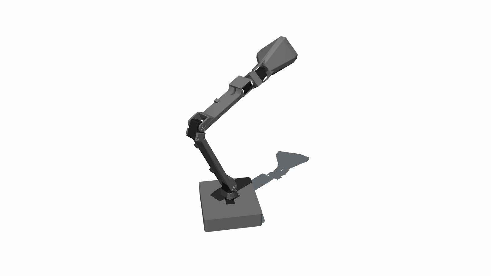
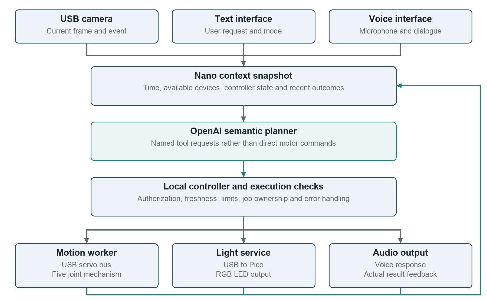
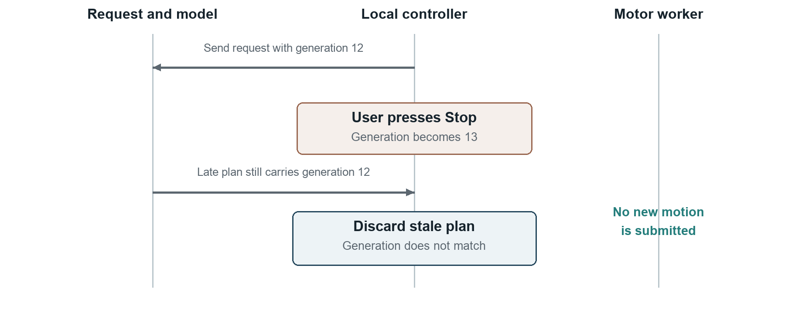
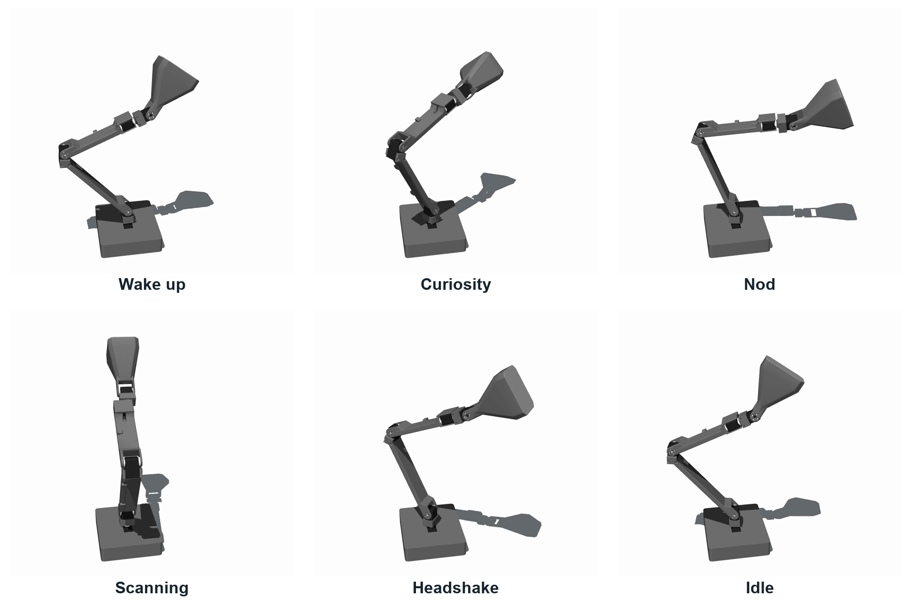

# TEAM8 AiLamp

## Technical Report on an AI Controlled Robotic Desk Lamp

Embedded Systems, Cyber-Physical Systems and Robotics

INHN0018 · Technical University of Munich · Campus Heilbronn

Group 8 · Summer Semester 2026 · 8 September 2026

*Project visualization using the original articulated lamp geometry. The embedded platform in our system design is Jetson Nano.*

### Abstract

TEAM8 AiLamp explores how a desk lamp can communicate through physical movement while responding to visual context and natural-language instructions. Our full design combines a Jetson Nano, five bus servos, a USB camera, an OpenAI decision layer, an optional voice interface and programmable lighting. The model proposes bounded actions through explicit tools; a local controller checks authorization, command validity, timing and actuator availability before execution. This report explains the requirements, hardware interfaces, software architecture and staged verification method. The available evidence includes source implementations, a six-gesture motion demonstration, team-reported actuator observations and a public software test run with 136 passing and five failing tests. These establish a concrete integration design and a visible motion vocabulary, while leaving integrated visual and voice triggering, lighting operation and quantitative physical performance to further validation. The central engineering finding is that semantic decisions and physical execution require separate timing, ownership and completion contracts.

<!-- page -->

## 1 Project Objectives and Requirements

### 1 1 Interaction concept

A conventional desk lamp is adjusted by hand and communicates little about its state. Our initial AiLamp concept adds an articulated body and an AI decision layer so that the lamp can acknowledge a request, look curious, attend to a person or remain quiet during work. Motion, speech and light are complementary outputs. For example, a request to focus can select a stable posture and warm illumination, while a short nod can acknowledge the instruction without a long spoken response.

The project is a cyber-physical system because decisions in software affect a weighted, moving mechanism, and observations from the environment influence subsequent decisions. The design therefore includes both semantic behavior and explicit execution constraints. A successful language response alone is insufficient: the selected action must be valid for the current configuration and its outcome must be observable.

### 1 2 Scope and requirements

The full design retains vision, voice and lighting even when a particular bench configuration lacks those channels. Text control and recorded motions provide a useful operating path during incremental integration. Automatic behaviors are limited to desk interaction and configurable focus and rest modes. The course requires a technical report covering the project, methodologies and findings, alongside code, slides and an action video in the group repository [1, 2].

| ID | Requirement | Evidence needed for acceptance |
| --- | --- | --- |
| R1 | Expressive movement across five joints | Correct joint mapping and repeatable physical playback |
| R2 | AI selection of an appropriate response | Logged input, validated tool plan and execution outcome |
| R3 | Visual awareness of nearby activity | Timestamped camera events and labeled scenario trials |
| R4 | Spoken interaction | Recorded command, tool result and intelligible audio reply |
| R5 | Controllable color and brightness | LED acknowledgement and observed light output |
| R6 | Local override and bounded execution | Tests for stale plans, limits, stop and conflicting jobs |
| R7 | Reproducible project delivery | Pinned source, dependencies, assets and passing checks |

*Table 1. System requirements and the evidence needed to accept each capability.*

### 1 3 Design context

ELEGNT investigates how movement can express attention and intention in a non-anthropomorphic robot [3]. We use that distinction between functional and expressive movement as design context, not as evidence that our lamp improves user engagement. The mechanical assets and recorded motion foundation come from Human Computer Lab's open-source LeLamp and runtime [4, 5]. Our work focuses on the Nano integration, multimodal software architecture, behavior configuration, local control logic and course demonstration. These boundaries keep the report's contribution specific and reproducible.

<!-- page -->

## 2 System Architecture

### 2 1 Semantic decisions and local execution

The AI brain selects a response at the level of intent. It receives a user instruction, optional visual context, the current operating state and recent action outcomes. Its output is a small set of named tool calls. It does not write arbitrary Python, invent serial packets or directly energize a servo. This separation allows the language model to influence behavior without making the model response itself an actuator command.

*Figure 1. Full target architecture. Voice and lighting remain part of the design; their presence in this diagram does not imply that those channels have passed integrated hardware validation. All physical action requests should pass through one local controller.*

The Nano owns device interfaces, state and scheduling. OpenAI provides cloud-based semantic inference. Local validation is independent of whether the model request succeeds. The controller can reject a request because the lamp is disarmed, the image is too old, an earlier job is still active or the current state has changed. A rejected plan is an outcome to report, rather than a reason to bypass the controller.

### 2 2 Feedback and deployment boundaries

Feedback has two distinct meanings. Encoder or worker feedback describes execution, while a new camera observation describes the external scene. Neither should be replaced by the model's own previous explanation. The next decision receives actual outcome records so that an unsuccessful command is not remembered as a completed movement.

The school repository contains the earlier service-based integration and voice tools [2]. The more recent OpenAI brain and web-controller implementation is a separate local development snapshot [11]. This report describes the intended unified architecture and identifies that integration boundary where relevant. Reproducing the public commit alone does not reproduce every local feature discussed here.

<!-- page -->

## 3 Hardware Platform and Interfaces

### 3 1 Embedded platform

Jetson Nano is the selected host for device access and control. Its Linux environment supports the separation of camera capture, network requests and actuator services. NVIDIA documents the developer kit's microSD-based setup and peripheral interfaces [6]. The design uses API-assisted perception to reduce the need to run a large multimodal model locally. This is a deployment choice, not a measured claim that a particular local detector is too slow.

| Subsystem | Original AiLamp design selection | Integration role |
| --- | --- | --- |
| Main computer | Jetson Nano Developer Kit 4GB | Linux host, state and device services |
| Actuation | Five ST3215 bus servos | Base, arm and lamp-head movement |
| Servo interface | Waveshare ESP32 servo driver | USB serial to servo bus |
| Camera | USB UVC camera, UB0234 in design BOM | Image capture for visual context |
| Light controller | Raspberry Pi Pico WH | USB serial commands to LED signal |
| Light source | 64-pixel RGB NeoMatrix in design BOM | Color and brightness output |
| Audio | ReSpeaker XVF3800 and speaker in design BOM | Microphone input and audio output |
| Network | USB Wi-Fi adapter or wired connection | Remote access and cloud requests |

*Table 2. Configuration-level component selections [7]. The assembled camera model and audio peripherals require an inventory check before procurement-level or compatibility claims. The current LED channel is unavailable, and integrated audio operation has not been established.*

### 3 2 Power and data are different connections

The design separates the Nano supply, the servo power supply and the LED supply. USB carries data between the Nano and controllers; it should not be treated as the supply path for the five loaded motors or a full LED matrix. The design configuration specifies a 12 V servo domain and a separate 5 V LED domain [7]. Positive rails must not be joined. Non-isolated signal interfaces require the appropriate ground reference, while wiring and connectors must be checked against the actual board revision.

USB ports also form a finite resource. The servo adapter, camera, optional sound device and Wi-Fi adapter all compete for physical connectors and potentially bus bandwidth. A hub, if introduced, becomes part of the validated topology rather than an invisible accessory. Device names such as ttyACM0 can change after reconnection; stable device identity is preferable to guessing from enumeration order.

The network path and the motor path are separate dependencies. A working Wi-Fi association or SSH login proves neither cloud API access nor actuator readiness. Conversely, a cloud timeout should not prevent a locally authorized recording from being tested without cloud inference.

<!-- page -->

## 4 Five Joint Motion and Mechanical Constraints

### 4 1 Logical joint mapping

The mechanism uses five commanded joints. The original lamp arm, head and diffuser define the motion identity. Our Nano-related mechanical work concerns the electronics enclosure and cable accommodation; it does not require inventing a different articulated lamp. Motor identity must be mapped by logical name rather than by assuming that an array's order equals the numerical servo order.

| Servo ID | Logical joint | Main expressive role |
| --- | --- | --- |
| 1 | base_yaw | Turn the body left and right |
| 2 | base_pitch | Raise or lower the first arm segment |
| 3 | elbow_pitch | Extend or retract the middle of the arm |
| 4 | wrist_roll | Rotate the lamp-head connection |
| 5 | wrist_pitch | Tilt the lamp head for nodding and attention |

*Table 3. Logical mapping used by the project configuration. The source model's actuator array is ordered 2, 1, 3, 4, 5, so index-based assumptions can swap the first two joints [7, 13].*

### 4 2 Coordinate interpretation

The LeRobot-compatible recordings use normalized joint positions in the range -100 to 100. These values are not degrees. Mapping them to a physical joint depends on its calibration, orientation and usable range. A normalized value of zero is a coordinate reference, not a guarantee of a mechanically safe resting pose. The local OpenAI interface limits a single requested joint delta to four normalized units in either direction [11].

This distinction explains why changing a zero point is not enough to repair an inconsistent range. The reference, lower and upper travel limits, sign convention and current position must agree. A video renderer can interpolate a valid-looking pose even when those physical conditions are wrong. Calibration records therefore belong to the deployment evidence, not to presentation graphics.

### 4 3 Playback and return motion

Recorded CSV trajectories provide a repeatable vocabulary of gestures. Playback resolves each named column, interpolates successive targets and delegates serial access to the motor layer. The first frame is important: moving directly from an arbitrary present posture to a recording's initial pose can create a large discontinuity. A deployment should validate the whole transition, including approach, gesture, return and interruption.

Return-to-home is itself a motion job. It should use a verified pose in the current calibration and pass through the same ownership and limit checks as any other command. It is not equivalent to writing zero to every joint. The physical observation that an unpowered arm cannot hold its own weight also matters: releasing torque can make the mechanism fall. Holding a target, stopping future frames and cutting power have different mechanical consequences and must be named separately in the operator interface.

<!-- page -->

## 5 AI Brain and Tool Contract

### 5 1 Decision input and output

The original concept makes AI the high-level decision maker rather than a decorative chat interface. A user can request an interaction in ordinary language; visual context can influence whether a response is appropriate. The development implementation uses OpenAI's Responses interface with function definitions, an optional JPEG image, compact state and bounded recent history [11]. Function calling provides a structured way for an application to receive proposed actions, but the application remains responsible for executing them [8].

| Tool | Accepted content | Local restriction |
| --- | --- | --- |
| play_recording | Logical recording name | Name must be in the available allowlist |
| move_joints | Named normalized joint deltas | Known joints only, each within -4 to 4 |
| set_light | Integer RGB and optional brightness | Every channel within 0 to 255 |
| set_mode | focus, rest or manual | Optional timer bounded to 1 to 180 minutes |
| do_nothing | Short explanation | Must be the only action in the plan |

*Table 4. Tool contract in the local OpenAI development snapshot [11]. At most two actions and at most one motor action are accepted per decision. These are application bounds, not guarantees supplied by the model service.*

### 5 2 Validation is part of control

The implementation validates names, types, finite numeric values, argument structure and action combinations after receiving a response. It also limits input and output sizes. The tool schemas use non-strict generation settings, so local validation is especially important: a schema description should not be confused with proof that a returned value is executable. Unknown actions, malformed arguments and duplicate motor requests are rejected.

For example, an acknowledgement may propose play_recording with the name nod. The local system first checks whether nod exists, whether motion output is enabled and armed, and whether the motor worker can accept the job. Only then can it submit playback. The model's accompanying sentence is a conversational response; it is not evidence that the lamp nodded.

### 5 3 Model choice and bounded autonomy

The configured development default is gpt-4.1-mini, with the provider now set to OpenAI after an earlier Claude proof of concept. Model selection remains configurable. No accuracy or response-time ranking between providers has been measured in this project. The implementation imposes a call budget and a request timeout, with automatic SDK retries disabled in the inspected client path [11].

The model can select do_nothing when evidence is weak or no movement is useful. It cannot authorize hardware output, override a stop, expand calibration limits or choose arbitrary files. This is bounded task-level autonomy. It does not claim general robotic manipulation, collision-free planning or control at the servo's internal update rate.

<!-- page -->

## 6 Visual Perception and Context

### 6 1 Camera processing path

The full AiLamp design uses a USB camera to describe the situation around the desk. The Nano profile selects an API-hybrid path: local capture produces an image, and a cloud vision request supplies semantic context. A structured event can then be stored in vision_state.json for the behavior service and voice tools. The newer brain path can also consume a current frame directly. These are alternative integration paths; they should not both launch redundant cloud decisions for every frame.

| Configuration item | Nano profile value | Meaning |
| --- | --- | --- |
| Capture format | 640 by 480 at 15 frames per second | Requested camera format |
| Cloud image size | Maximum side 512 pixels | Request preparation limit |
| Vision interval | 1.0 second | Configured request scheduling interval |
| Request timeout | 10 seconds | Failure boundary for a request |
| Event lifetime | 2.0 seconds | Maximum configured age for usable events |
| Behavior cooldown | 1.5 seconds | Limits repeated event-driven actions |

*Table 5. Setpoints from the original Nano profile [7]. They are not observed frame rate, measured network latency or demonstrated recognition accuracy.*

### 6 2 Behavior mapping and uncertainty

The original behavior map includes no person, person to one side, a person close to the lamp, studying and looking at the lamp. These labels map to expressive recordings and light colors. For instance, studying selects a quiet idle behavior, while looking at the lamp can select a nod. A configured left-side event mapped to a headshake is a symbolic response, not a calibrated gaze controller. Accurate person tracking would additionally require a camera-to-robot relationship and a validated target-to-joint mapping.

Visual labels such as studying or looking at the lamp should be treated as uncertain interpretations. They are not measurements of attention, emotion or learning quality. The system should retain timestamps and confidence where available, handle missing observations explicitly, and avoid repeated physical reactions to the same persistent scene.

### 6 3 Timing and data handling

Camera acquisition, model inference and motion playback operate at different rates. The capture frame rate must not be used as the AI control frequency. A request can outlive the event that motivated it. Consequently, image age and plan age must be checked again when execution is attempted, not only when the request starts.

For evaluation, each trial should preserve the event label, capture time, request time, model result, accepted action and final outcome under one identifier. Raw images need only be retained when they serve a defined debugging or evaluation purpose. People near the camera should know when images leave the device. The current evidence does not establish live visual triggering on the physical lamp; that remains a separate acceptance test from camera enumeration or video rendering.

<!-- page -->

## 7 Voice and Lighting Channels

### 7 1 Spoken interaction design

The original plan includes a microphone, speaker and conversational interface so that a user can interact without opening the control page. The public runtime integrates LiveKit and OpenAI voice components through a toolbox that exposes vision state, recording names and motion or light operations [2, 5]. LiveKit supports both speech pipelines and realtime-model integration [9]. Our report does not assume that choosing either interface solves device selection, acoustic feedback or physical execution.

The intended spoken interaction follows an explicit sequence. Audio input becomes a conversational turn; the agent interprets the request, optionally consults visual state and proposes a tool action. The local controller validates and executes it. Speech output then describes the actual result. If the lamp is locked or the motor job fails, the spoken response should report that condition rather than announcing success.

The earlier voice toolbox can address its output services directly, while the newer web brain uses the controller's arming and generation checks. A unified release must route voice-triggered physical actions through that same controller. Running both paths independently would undermine single ownership of the motor bus. Microphone and speaker integration is therefore a software arbitration task as well as an audio wiring task.

### 7 2 Light control design

Programmable light provides a quiet status channel and supports the original focus scenario. A Pico-based controller converts simple serial messages into LED output. The inspected protocol supports PING, CLEAR, SOLID, BRIGHTNESS and PIXELS, with bounded channel values. A host request waits for a reply; an empty response or an ERR reply is treated as a failure [11]. A serial acknowledgement establishes that the controller responded, not that the emitted color or illumination level has been measured.

The original design separates LED power from Nano power. Adafruit recommends a data-line resistor, a supply capacitor and appropriate logic-level translation for typical NeoPixel arrangements [10]. A component purchase quantity does not determine how many resistors a particular circuit requires. For a single pixel chain, the protective series component belongs at its data input; board-integrated protection and the exact controller must be checked before final wiring.

The current lamp's LED channel is unavailable. Accordingly, lighting remains an architectural feature and implemented protocol, but is not counted as a validated physical result. No measured illuminance, color accuracy or flicker result is claimed.

### 7 3 Degraded operation

Unavailable audio or light should not disable independently valid text and motion functions. The interface should present capabilities explicitly so that the AI does not repeatedly request a missing output. In a quiet or partially assembled setup, a text response and a recorded gesture can demonstrate the same intended interaction. This preserves the original multimodal design while making the active hardware configuration honest and usable.

<!-- page -->

## 8 Runtime Coordination and Failure Handling

### 8 1 State and command ownership

The local controller distinguishes preview operation from real outputs, tracks whether hardware is armed, and manages manual, focus and rest modes. The motor worker is the sole writer for a given actuator connection. Before admitting a new motor action, the controller settles the prior outcome and checks whether the worker remains busy. This avoids presenting a queued or rejected action as a newly completed gesture [11].

*Figure 2. A late-response scenario. The generation number changes after a stop or override. A response associated with the old generation is discarded even if its arguments are otherwise valid.*

### 8 2 Cancellation and time

A cloud request may be impossible to cancel immediately, so the controller invalidates its authority instead. The request captures a generation value. Stop, disarm or manual intervention changes that value; the response must still match when submitted. A separate deadline protects against a plan that is simply too old. Image freshness is another condition and cannot be inferred from the response's arrival time.

Accepted, sent and completed describe different stages. Acceptance means local validation succeeded. Sending means a worker began or transmitted a command. Completion means the execution layer reports a finished job without an error. Even completion at this level is not equivalent to an independently measured physical trajectory; encoder and external observations are needed for that claim.

### 8 3 Recovery behavior

On network failure, the system should preserve local state and expose the unavailable AI channel. It should not generate a surprise movement from a delayed retry. A deliberate switch to manual or configured behavior playback offers a controllable fallback. On a serial error, the pending job should report failure and further motion should wait for recovery rather than accumulating commands.

Software stop cancels future playback frames or holds the current commanded target according to backend behavior. It does not physically disconnect power and is not a certified emergency-stop function. Because the arm can lose support when torque is removed, recovery has to consider gravity and the present posture, not just clear an error message.

<!-- page -->

## 9 Engineering Methodology

### 9 1 Incremental integration

We organize development around interfaces that can be checked before full hardware integration. Requirements identify the intended interaction, configuration describes available components, and service contracts define what crosses each boundary. Recorded motions provide repeatable inputs for motor and rendering work. Mock devices and preview outputs allow malformed requests, missing peripherals and asynchronous failures to be explored without requiring a complete lamp.

The first verification layer checks pure data and configuration: joint names, recording paths, RGB ranges and event mapping. The second checks service behavior with controlled dependencies. Here, a fake clock or delayed model response can exercise expiration, stop and manual override deterministically. The third checks asset loading and visual continuity. Only then does physical integration establish serial communication, calibration and loaded motion.

### 9 2 Physical validation method

A useful physical trial begins from a documented configuration, not merely a successful previous run. The record should identify the board image, runtime revision, serial device, calibration digest and starting posture. The experiment then records the requested action, observed joint, encoder changes and operator observation. This lets the team separate an incorrect mapping from a mechanical obstruction, a calibration mismatch or a communication failure.

Individual actuator tests are necessary but do not establish coordinated playback under gravity. A full acceptance sequence must include transitions between recordings, a return motion and interruption while moving. It also needs repeated trials under comparable conditions. We do not derive repeatability, torque margin or collision clearance from the fact that a motor visibly moved once.

### 9 3 Scenario driven software checks

| Test family | Controlled condition | Expected behavior |
| --- | --- | --- |
| Input validation | Unknown tool, invalid type or excessive delta | Reject before output submission |
| Timing | Old frame or expired plan | Record rejection without motion |
| User override | Stop while a model request is pending | Discard the late plan |
| Concurrency | A second motor request while busy | Preserve single command ownership |
| Device failure | Missing LED reply or serial failure | Report channel failure explicitly |
| Capability limits | Audio or LED absent | Keep independent text and motion paths usable |

*Table 6. Verification cases implied by the architecture. These describe acceptance expectations, not a claim that every case has passed on the physical lamp.*

### 9 4 Evidence hierarchy

Source inspection establishes that a mechanism is represented in code. A unit test establishes behavior under its fixtures. A rendered sequence establishes visible geometry and timing. A physical test establishes behavior of a particular assembly. A controlled user study would establish something about interpretation or usability. We keep those evidence levels separate because each can succeed while a later one still fails. This hierarchy is also the basis for the findings reported next.

<!-- page -->

## 10 Expressive Motion Demonstration

The submitted motion video uses a fixed oblique viewpoint so that changes in the arm and lamp head remain comparable throughout the sequence. It presents six named gestures, framed as an interaction vocabulary. English subtitles describe their intended meaning. The file is 1920 by 1080 pixels at 30 frames per second, with 1,376 frames and a duration of approximately 45.87 seconds. It is silent and includes eight subtitle cues [12].

*Figure 3. Frames from the six-gesture sequence. Labels identify the intended gesture rather than a recognized environmental trigger. Motion should be judged in the accompanying video; a still frame cannot establish a trajectory.*

The sequence reuses the original recordings and lamp geometry. Wake-up introduces an active posture; curiosity changes the body and head orientation; nod and headshake provide acknowledgement-like gestures; scanning expresses searching; idle provides a quiet ending. These descriptions are design interpretations. Their recognizability has not been measured in a blinded participant study.

Technically, the video is generated by forward-kinematic playback in MuJoCo, with the base anchored and normalized recording values mapped into model joint ranges [13, 14]. It is useful for inspecting presentation, continuity and gross pose changes. It does not demonstrate physical motor execution, dynamic load capacity, live visual recognition, cloud decision making or audio interaction. The fixed camera makes the motion comparison easier; it does not change that evidence boundary.

<!-- page -->

## 11 Results and Findings

### 11 1 Software verification snapshot

The school repository's CI run for commit 3bfe93c recorded 136 passing tests and five failing tests, with pytest reporting 1.18 seconds [15]. This is a software-run duration on the CI environment, not the lamp's response latency. The run did not establish a fully passing release. Its failures fall into two concrete groups.

| Failure group | Count | Observed cause | Consequence |
| --- | --- | --- | --- |
| Adapter generation tests | 3 | Missing trimesh dependency | Generation checks cannot finish in CI |
| Documentation tests | 2 | Expected README text and design file absent | Published docs and tests are inconsistent |

*Table 7. Five failures in the public CI snapshot. The documentation assertions concern the literal term 2-manifold and an expected adapter design specification. These failures do not by themselves prove defective motor control, but they prevent a clean reproducibility claim.*

The passing tests show that many public-baseline checks execute successfully in that environment. Their count should not be combined with older local test totals or treated as coverage of the unpublished OpenAI controller. The repository snapshot, dependency environment and selected tests are part of the result.

### 11 2 Integration evidence

| Area | Available evidence | Conclusion supported |
| --- | --- | --- |
| Motion vocabulary | Six-gesture video and source recordings | Gestures can be presented in a consistent view |
| Individual actuators | Team-reported visible joint movement | Initial actuator function was observed |
| AI brain | Inspected local tool and controller code | Bounded decision and execution contracts exist |
| Camera triggering | Configuration and service paths | Design and software integration path exist |
| Voice and light | Voice toolbox and LED protocol | Interfaces exist; full hardware operation remains unverified |

*Table 8. Evidence summary. No end-to-end multimodal success rate or repeated physical motion dataset is available for this report.*

### 11 3 Engineering findings

The most consequential finding is the need to separate semantic success from execution success. An AI reply, a valid plan and a completed motor job are different events. A second finding concerns calibration: normalized coordinates and zero references must be interpreted with their ranges, especially when recordings move between environments. Finally, optional peripherals and cloud connectivity should be represented as capabilities. Otherwise, an unavailable LED or microphone can unnecessarily block a useful motion demonstration or cause misleading success messages.

<!-- page -->

## 12 Discussion and Further Evaluation

### 12 1 What the prototype establishes

The design brings the original AiLamp concept into a concrete architecture for Jetson Nano. Its main contribution is the relationship between multimodal intent, explicit tools, local ownership and outcome feedback. The motion demonstration gives that architecture an understandable physical vocabulary. The evidence is strongest for source-level structure and visual presentation, with initial actuator observations providing a separate, limited indication of hardware progress.

The architecture still needs an integrated acceptance run. In particular, the earlier voice path must share the newer controller's checks, and the local OpenAI development files must be reconciled with the public repository. The known CI failures are release-quality issues that should be repaired and rerun before claiming that a fresh checkout is fully reproducible. A rendered video does not replace the course's physical in-action evidence if the instructor expects a live hardware demonstration [1].

### 12 2 Measurement protocol

Future evaluation should use a fixed set of scenarios with recorded expected behavior: a direct nod request, a person entering view, a quiet focus interval, an unavailable output and a stop during a pending AI request. Repeated trials should preserve the same calibration and starting posture. Each trial needs a unique identifier linking observation, decision, acceptance, transmission and completion.

Response time should be reported at several boundaries. Capture-to-decision measures perception and inference; decision-to-start measures scheduling and execution admission; start-to-settled measures the mechanism. Report the median and a high percentile, together with the trial count and failure count. An average alone can hide occasional cloud delays. Failure trials must remain in the dataset rather than being silently dropped.

For motion, measure the final position error and variation across repeated returns, with the coordinate system and measurement device stated. If encoder readings are used, distinguish them from external measurement of the lamp head. For perception, annotate the selected scenario classes and report confusion counts, including unknown and rejected cases. For gesture interpretation, ask participants to label unlabeled clips before showing captions; captions would otherwise reveal the intended answer.

### 12 3 Deployment limitations

The Nano's older operating-system stack and the project's Python dependency requirements need a tested environment bridge. A desktop Python installation cannot be assumed to run unchanged on the board. Network availability, USB topology, gravity loading and cable routing also remain deployment constraints. A release should record the tested combination of operating system, Python environment, device topology and calibration.

### 12 4 Conclusion

TEAM8 AiLamp defines an AI-controlled desk lamp with vision, voice, five-axis expression and programmable light. The available implementation and demonstration support this design direction, while the results identify specific integration and reproducibility gaps. The next milestone is a pinned, passing software release followed by timestamped physical scenario trials. That would turn the current design and partial verification into an auditable end-to-end system result.

<!-- page -->

## 13 Reproducibility and Team Contribution

### 13 1 Source snapshots

The public group repository is the course delivery location. Its revision must be identified alongside any claim of reproduction. The following sources separate public artifacts from later local development. This matters because the report covers the original full design as well as the newer bounded OpenAI brain, while those materials are not all present in the same public commit.

| Material | Identifier or location | Reproduction boundary |
| --- | --- | --- |
| School repository | TUM-HN-Team8_LeLamp, commit 3bfe93c | Public baseline and video |
| Original geometry | LeLamp, source commit 9650849 | Upstream identity recorded in NOTICE |
| Original recordings | lelamp_runtime, source commit ee23699 | Upstream motion assets recorded in NOTICE |
| OpenAI controller | Local brain.py, brain_runtime.py and controller.py | Development snapshot inspected on 8 September |
| Video | docs/video/TEAM8_AiLamp_Expressive_Motion_EN.mp4 | Published English-captioned motion sequence |

*Table 9. Source boundaries [2, 11, 12]. Full repository and CI links appear in the references. The local development sources need a published revision before an external reader can reproduce that implementation.*

### 13 2 Reproduction procedure

An evaluator should first retrieve the named public commit and inspect README, NOTICE, the hardware profile and dependency manifest. The software test result should be compared with the recorded CI run. Any changes to dependencies or missing files should produce a new revision and a new result, not a retroactive alteration of the result in Section 11.

The video can be played independently of hardware and cloud accounts. To reproduce its visual sequence, retain the source model, recordings, joint mapping, fixed camera and timing metadata. To reproduce physical operation, additionally identify the Nano environment, actual peripheral inventory, controller connection and calibration record. API credentials and network passwords should never be included in the course repository or the report.

### 13 3 Team organization and attribution

Group 8 is a seven-person team. Yu Gu serves as team leader and carries primary responsibility for software coordination and a large share of the implementation. The software work connects configuration, perception, decision making, motion services and the operator interface. Hardware assembly, peripheral integration, validation and presentation complete the project's work packages. Clear interfaces allow those activities to proceed while the full system is assembled incrementally.

The project retains the upstream LeLamp attribution and GPL-3.0 notices already recorded in NOTICE [2, 4, 5]. TEAM8 AiLamp is the course project name. Reused mechanical assets and recordings remain distinguishable from the team's configuration, integration software, controller development and evaluation work. This preserves the engineering provenance of the result while making our own work identifiable.

<!-- page -->

## References

[1] INHN0018 course requirements summary. Project and Presentation Rules, supplied course document, compiled 30 August 2026. Records the required technical report, action video, PDF slides, code and group repository. Original course resource: https://www.moodle.tum.de/mod/page/view.php?id=3860685

[2] Group 8. TUM-HN-Team8_LeLamp. School repository, revision 3bfe93c5d5d6af8230c11c54697c4195821c5c89. README, NOTICE, TEAM, configuration and runtime sources. https://github.com/CPSCourse-TUM-HN/TUM-HN-Team8_LeLamp/tree/3bfe93c5d5d6af8230c11c54697c4195821c5c89

[3] Y. Hu, P. Huang, M. Sivapurapu and J. Zhang. ELEGNT Expressive and Functional Movement Design for Non-Anthropomorphic Robot. Apple Machine Learning Research, January 2025. https://machinelearning.apple.com/research/elegnt-expressive-functional-movement

[4] Human Computer Lab. LeLamp. Open-source expressive robot lamp, mechanical assets and build documentation. https://github.com/humancomputerlab/LeLamp

[5] Human Computer Lab. LeLamp Runtime. Motor control, recording and replay, and interaction runtime. https://github.com/humancomputerlab/lelamp_runtime

[6] NVIDIA. Get Started With Jetson Nano Developer Kit. Developer documentation. https://developer.nvidia.com/embedded/learn/get-started-jetson-nano-devkit

[7] Group 8. Jetson Nano hardware profile. config/hardware.jetson-nano.toml at the school revision in [2]. Configuration values are design setpoints, not measured performance. https://github.com/CPSCourse-TUM-HN/TUM-HN-Team8_LeLamp/blob/3bfe93c/config/hardware.jetson-nano.toml

[8] OpenAI. Function calling. API documentation describing model tool requests and application-side execution. https://developers.openai.com/api/docs/guides/function-calling

[9] LiveKit. Models overview. Agents documentation covering speech pipelines, realtime models and provider plugins. https://docs.livekit.io/agents/integrations/plugins/

[10] Adafruit. NeoPixel Uberguide Best Practices. Electrical interface and power recommendations. https://learn.adafruit.com/adafruit-neopixel-uberguide/best-practices

[11] Group 8. Local AILamp OpenAI development snapshot, inspected 8 September 2026. ailamp_runtime/ailamp/services/brain.py, brain_runtime.py, controller.py, led_serial.py and agent/livekit_agent.py; design specification docs/superpowers/specs/2026-09-05-openai-brain-no-audio-design.md. Not included in the public revision cited in [2] as a complete feature set.

[12] Group 8. TEAM8 AiLamp Expressive Motion. English-captioned video, SRT and accompanying README. https://github.com/CPSCourse-TUM-HN/TUM-HN-Team8_LeLamp/tree/3bfe93c/docs/video

[13] Group 8. Motion video rendering metadata, 8 September 2026. preview_metadata.json and render_lelamp_video.py in the local video production record. Records source digests, joint mapping, camera parameters and forward-kinematic scope.

[14] Google DeepMind. MuJoCo Overview. Simulation and modeling documentation. https://mujoco.readthedocs.io/en/stable/overview.html

[15] Group 8. GitHub Actions run 34236423236, 8 September 2026. Public revision 3bfe93c; pytest result 136 passed and 5 failed. https://github.com/CPSCourse-TUM-HN/TUM-HN-Team8_LeLamp/actions/runs/34236423236

*External documentation and repository evidence inspected on 8 September 2026. References [1], [11] and [13] identify supplied or local project records rather than independently published experimental studies.*
